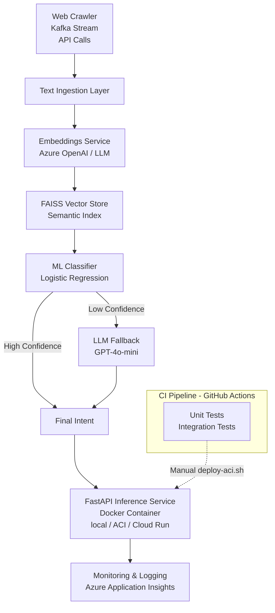

# LLM-Ops Demo Projekt (Azure OpenAI + Lokale Vektorsuche)

## Architecture



## Setup
```bash
python3 -m venv .venv
source .venv/bin/activate
pip install -r requirements.txt
cp env_example.txt .env
```
then paste API keys into .env
## Create index and train model
```bash
python3 data/create_intents.py
python3 data/generate_embeddings.py
python3 data/build_faiss.py
python3 model/train_classifier.py
```

## Run in console
```bash
## Start backend
uvicorn app.app:app --reload --port 8001

# Example usage
curl -X POST "http://localhost:8001/predict" \
     -H "Content-Type: application/json" \
     -d '{"text": "Ich kann mich nicht einloggen"}'
```

## Docker deploy on prem 
```bash
docker build -t llmops-api .

# HOST_PORT:CONTAINER_PORT, FastAPI used 8001, hence CONTAINER_PORT=8001
docker run -p 8001:8001 --env-file .env llmops-api

# use adress in chrome instead safari
http://0.0.0.0:8001/docs
```

## Docker deploy on Azure

**WICHTIG:** Stelle sicher, dass diese Dateien lokal vorhanden sind (werden ins Docker Image kopiert):
- `model/artifacts/model.pkl`
- `model/artifacts/label_encoder.pkl`
- `data/vector_db/faiss.index`

```bash
# 1. Docker Image bauen (prüft automatisch ob alle benötigten Dateien vorhanden sind)
docker build -t llmops-api .

# 2. Azure Login
az login

# 3. ACR Login (Azure Container Registry)
az acr login -n acrllmopsdemo2 

# 4. Admin Account aktivieren (nur beim ersten Mal oder wenn disabled)
az acr update -n acrllmopsdemo2 --admin-enabled true

# 5. Image taggen
docker tag llmops-api acrllmopsdemo2.azurecr.io/llmops-api:v1

# 6. Image in ACR pushen
docker push acrllmopsdemo2.azurecr.io/llmops-api:v1

# 7. Deployment in Azure Container Instances
# (stellt sicher, dass .env Datei vorhanden ist und alle ENV-Variablen enthält)
bash deploy-aci.sh
```

**Hinweis:** Das `deploy-aci.sh` Script gibt nach erfolgreichem Deployment automatisch die Container-URLs aus (FQDN und IP).


```bash
# 8. example usage
curl -X POST "http://<deine-azure-ip>:8001/predict" \
     -H "Content-Type: application/json" \
     -d '{"text": "Meine Bezahlung schlägt fehl"}'
```

## Application Insights activate (Azure)
```bash
az monitor app-insights component create \
  --app ins-llmops-demo \
  --location westeurope \
  --resource-group rg-llmops-demo
```
### See metrics
portal -> Application Insights -> ins-llmops-demo
 -> Investigate -> Transaction search


# First steps for Azure setup

curl -sL https://aka.ms/InstallAzureCLIDeb | sudo bash   # (Linux)
az login
az account set --subscription "DEINE_SUBSCRIPTION_ID"


python -m venv .venv
source .venv/bin/activate
pip install requirements.txt


# Ressourcengruppe
az group create -n rg-llmops-demo -l westeurope

->
{
  "id": "/subscriptions/8659e0d0-fc48-4f86-937b-73e4cc5ea05b/resourceGroups/rg-llmops-demo",
  "location": "westeurope",
  "managedBy": null,
  "name": "rg-llmops-demo",
  "properties": {
    "provisioningState": "Succeeded"
  },
  "tags": null,
  "type": "Microsoft.Resources/resourceGroups"
}


# Storage Account
az storage account create -n llmopsstorage$RANDOM -g rg-llmops-demo -l westeurope --sku Standard_LRS
-> musste manuelle im Portal unter Storage Accounts angelegt werden

# Key Vault
az keyvault create -n kv-llmops-demo -g rg-llmops-demo -l westeurope
-> musste ich auch manuell im Portal unter "Key Vaults" erstellt werden

# Azure Machine Learning Workspace
az ml workspace create -w mlw-llmops-demo -g rg-llmops-demo -l westeurope
-> Portal -> Azure MAchine Learning. dort die vorher gewählen Storage Acc und Key Vaults nehmen

# Azure Cognitive Search (für Vector)
az search service create --name llmops-search-$RANDOM --resource-group rg-llmops-demo --sku basic --location westeurope
-> jetzt AI Foundry > AI Search. Kostet aber 250 Doller / Monat -> wir machen das doch nicht, sondern Azure OpenAi direkt nutzen


az cognitiveservices account create \
  -n aoai-llmops-demo \
  -g rg-llmops-demo \
  -l westeurope \
  --kind OpenAI \
  --sku S0
-> gibt es nicht. Sind bei Subscription -> Resources -> Create Azure AI services gegangen.

az keyvault secret set --vault-name kv-llmops-demo --name openai-key --value "DEIN_API_KEY"


Einen Compute-Cluster anlegen:
az ml compute create \
  -g rg-llmops-demo \
  -w mlw-llmops-demo \
  -n cpu-cluster \
  --size Standard_DS2_v2 \
  --min-instances 0 \
  --max-instances 2

-> Preview version of extension is disabled by default for extension installation, enabled for modules without stable versions. 
Please run 'az config set extension.dynamic_install_allow_preview=true or false' to config it specifically. 
The command requires the extension ml. Do you want to install it now? The command will continue to run after the extension is installed. (Y/n): Y
Run 'az config set extension.use_dynamic_install=yes_without_prompt' to allow installing extensions without prompt.
Unknown compute type: None

-> im Portal:
	1.	Gehe ins Portal → Suche: “Machine Learning”
	2.	Öffne deinen Workspace: mlw-llmops-demo
	3.	Links im Menü: Compute
	4.	Registerkarte Compute clusters
	5.	Klick auf + New
Compute Types:
Standard_DS11_v2 und Standard_DS3_v2

  az ml job create --file model/job.yml \
  -g rg-llmops-demo \
  -w mlw-llmops-demo