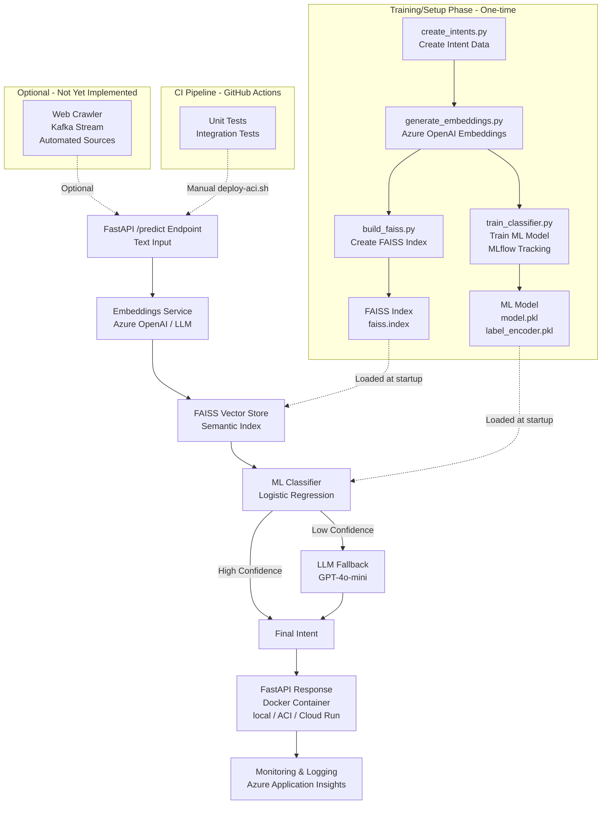

# LLM-Ops Demo Project (Azure OpenAI + Local Vector Search)

## Executive Summary

This project demonstrates a production-ready **Intent Classification System** that combines classical machine learning with modern LLM capabilities for efficient and cost-effective customer support automation.

### What It Does

The system automatically classifies customer inquiries into predefined intent categories (e.g., login problems, payment issues, account changes) using a hybrid approach:
- **Fast ML-based classification** for high-confidence predictions
- **LLM fallback** for ambiguous cases requiring deeper understanding
- **Semantic search** via FAISS vector store for retrieval-augmented classification

### Goals

1. **Cost Efficiency**: Use lightweight ML models for the majority of requests, only invoking expensive LLM APIs when necessary
2. **Production Readiness**: Demonstrate MLOps best practices including model versioning (MLflow), CI/CD pipelines, containerized deployment, and monitoring
3. **Scalability**: Deploy on Azure Container Instances with horizontal scaling capabilities
4. **Accuracy**: Achieve high classification accuracy through hybrid ML + LLM approach with confidence-based routing

### Use Cases

- **Customer Support Automation**: Route customer inquiries to appropriate support teams or automated responses
- **Ticket Classification**: Automatically categorize support tickets, emails, or chat messages
- **Intent-Based Routing**: Direct user queries to specialized handlers based on detected intent
- **Analytics**: Track common customer issues and trends through classified intent data

### Key Features

- 🎯 **10 Intent Categories**: Login problems, payment issues, account changes, technical errors, subscriptions, delivery, returns, product info, security, and general questions
- 🚀 **Hybrid Architecture**: Fast ML classifier (Logistic Regression) with LLM fallback (GPT-4o-mini) for edge cases
- 📊 **MLflow Integration**: Model versioning, experiment tracking, and artifact management
- 🔍 **FAISS Vector Search**: Local semantic search for retrieval-augmented classification
- 🐳 **Containerized Deployment**: Docker-based deployment on Azure Container Instances
- 📈 **Monitoring**: Azure Application Insights integration for production observability
- ✅ **CI/CD Pipeline**: Automated testing and deployment via GitHub Actions

---

## Architecture



## Setup
```bash
python3 -m venv .venv
source .venv/bin/activate
pip install -r requirements.txt
cp env_example.txt .env
```
then paste API keys into .env
## Create index and train model
```bash
python3 data/create_intents.py
python3 data/generate_embeddings.py
python3 data/build_faiss.py
python3 model/train_classifier.py
```

## Run in console
```bash
## Start backend
uvicorn app.app:app --reload --port 8001

# Example usage
curl -X POST "http://localhost:8001/predict" \
     -H "Content-Type: application/json" \
     -d '{"text": "Ich kann mich nicht einloggen"}'
```

## Docker deploy on prem 
```bash
docker build -t llmops-api .

# HOST_PORT:CONTAINER_PORT, FastAPI used 8001, hence CONTAINER_PORT=8001
docker run -p 8001:8001 --env-file .env llmops-api

# use adress in chrome instead safari
http://0.0.0.0:8001/docs
```

## Docker deploy on Azure

**IMPORTANT:** Make sure these files are locally available (will be copied into Docker image):
- `model/artifacts/model.pkl`
- `model/artifacts/label_encoder.pkl`
- `data/vector_db/faiss.index`

```bash
# 1. Build Docker image (automatically checks if all required files are present)
docker build -t llmops-api .

# 2. Azure Login
az login

# 3. ACR Login (Azure Container Registry)
az acr login -n acrllmopsdemo2 

# 4. Enable admin account (only first time or if disabled)
az acr update -n acrllmopsdemo2 --admin-enabled true

# 5. Tag image
docker tag llmops-api acrllmopsdemo2.azurecr.io/llmops-api:v1

# 6. Push image to ACR
docker push acrllmopsdemo2.azurecr.io/llmops-api:v1

# 7. Deploy to Azure Container Instances
# (ensures .env file exists and contains all ENV variables)
bash deploy-aci.sh
```

**Note:** The `deploy-aci.sh` script automatically outputs container URLs (FQDN and IP) after successful deployment.


```bash
# 8. Example usage
curl -X POST "http://<your-azure-ip>:8001/predict" \
     -H "Content-Type: application/json" \
     -d '{"text": "Meine Bezahlung schlägt fehl"}'
```

## Application Insights activate (Azure)
```bash
az monitor app-insights component create \
  --app ins-llmops-demo \
  --location westeurope \
  --resource-group rg-llmops-demo
```
### See metrics
portal -> Application Insights -> ins-llmops-demo
 -> Investigate -> Transaction search


# First steps for Azure setup

curl -sL https://aka.ms/InstallAzureCLIDeb | sudo bash   # (Linux)
az login
az account set --subscription "YOUR_SUBSCRIPTION_ID"


python -m venv .venv
source .venv/bin/activate
pip install requirements.txt


# Resource Group
az group create -n rg-llmops-demo -l westeurope

->
{
  "id": "/subscriptions/8659e0d0-fc48-4f86-937b-73e4cc5ea05b/resourceGroups/rg-llmops-demo",
  "location": "westeurope",
  "managedBy": null,
  "name": "rg-llmops-demo",
  "properties": {
    "provisioningState": "Succeeded"
  },
  "tags": null,
  "type": "Microsoft.Resources/resourceGroups"
}


# Storage Account
az storage account create -n llmopsstorage$RANDOM -g rg-llmops-demo -l westeurope --sku Standard_LRS
-> had to be created manually in the portal under Storage Accounts

# Key Vault
az keyvault create -n kv-llmops-demo -g rg-llmops-demo -l westeurope
-> also had to be created manually in the portal under "Key Vaults"

# Azure Machine Learning Workspace
az ml workspace create -w mlw-llmops-demo -g rg-llmops-demo -l westeurope
-> Portal -> Azure Machine Learning. Use the previously selected Storage Account and Key Vaults there

# Azure Cognitive Search (for Vector)
az search service create --name llmops-search-$RANDOM --resource-group rg-llmops-demo --sku basic --location westeurope
-> now AI Foundry > AI Search. Costs 250 dollars/month -> we don't do that, instead use Azure OpenAI directly


az cognitiveservices account create \
  -n aoai-llmops-demo \
  -g rg-llmops-demo \
  -l westeurope \
  --kind OpenAI \
  --sku S0
-> doesn't exist. Went to Subscription -> Resources -> Create Azure AI services.

az keyvault secret set --vault-name kv-llmops-demo --name openai-key --value "YOUR_API_KEY"


# Create a compute cluster:
az ml compute create \
  -g rg-llmops-demo \
  -w mlw-llmops-demo \
  -n cpu-cluster \
  --size Standard_DS2_v2 \
  --min-instances 0 \
  --max-instances 2

-> Preview version of extension is disabled by default for extension installation, enabled for modules without stable versions. 
Please run 'az config set extension.dynamic_install_allow_preview=true or false' to config it specifically. 
The command requires the extension ml. Do you want to install it now? The command will continue to run after the extension is installed. (Y/n): Y
Run 'az config set extension.use_dynamic_install=yes_without_prompt' to allow installing extensions without prompt.
Unknown compute type: None

-> in the portal:
	1.	Go to Portal → Search: "Machine Learning"
	2.	Open your workspace: mlw-llmops-demo
	3.	In the left menu: Compute
	4.	Compute clusters tab
	5.	Click on + New
Compute Types:
Standard_DS11_v2 and Standard_DS3_v2

  az ml job create --file model/job.yml \
  -g rg-llmops-demo \
  -w mlw-llmops-demo